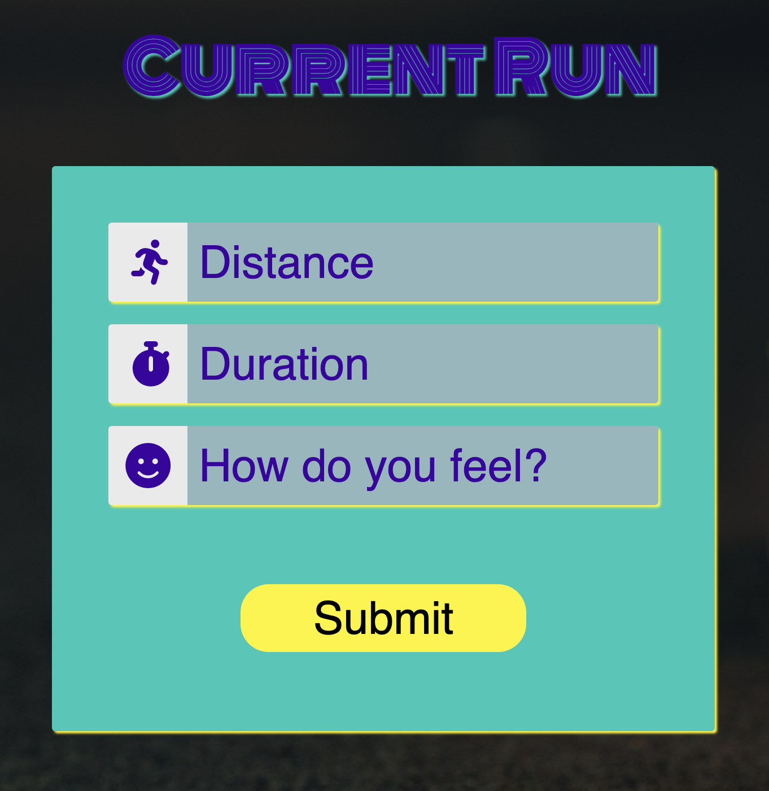
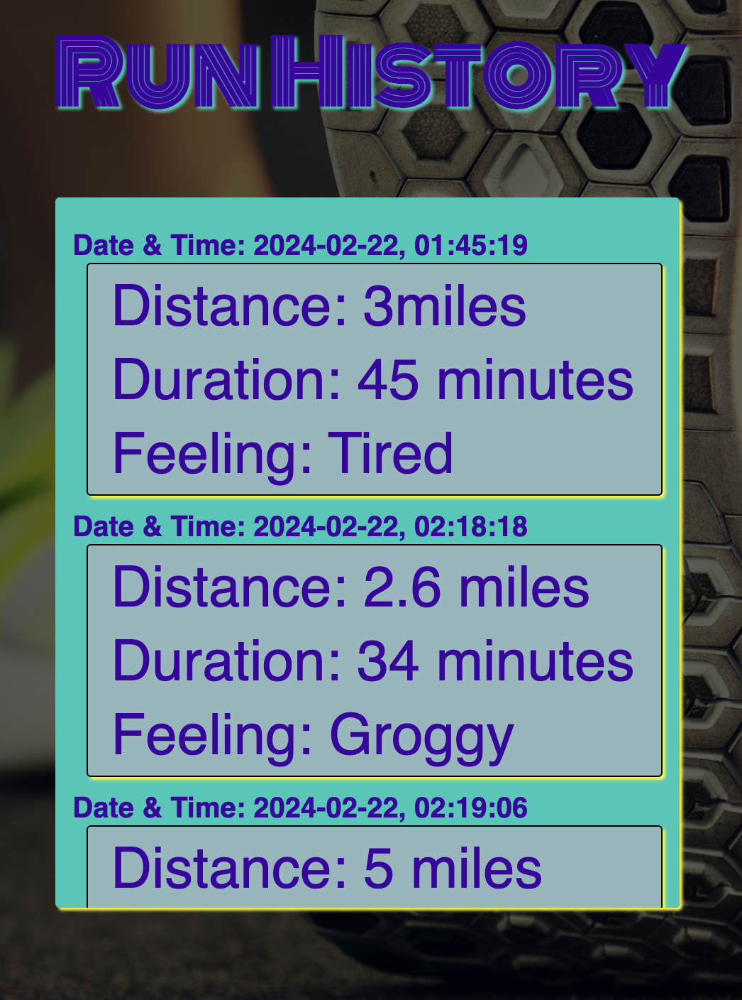

# Fitness Tracker [](https://opensource.org/licenses/MIT)


	


## Description:
Run Tracker is a website that allows runners to input their current run statistics to keep track of and track progress through past runs. 


## Table of Contents:
- [The Challenge](#The-Challenge)
- [Installation Process](#Installation-Process)
- [Usage Information](#Usage-Information)
- [Repository URL](#Repository-URL)
- [Heroku Deployment URL](#Heroku-Deployment-URL)
- [Screenshots](#Screenshots)
- [Built With](#Built-With)
- [Continued Development](#Continued-Development)
- [License](#License)
- [Authors](#Authors)


## The Challenge:
Working with your team, you’ll conceive and execute a design that solves a real-world problem. In creating a collaborative full-stack application, combine a robust back end—with servers, databases, and user authentication—to an intuitive front end.


## Installation Process

PRE-Requisites: 
- you must have node.js version 16.* installed on your computer prior to proceeding
- you must have MySQL/MariaDB installed on your computer prior to proceeding

### Database setup
This must be executed before launching the application
1. Log into your MySQL/MariaDB server.
2. Execute the following command:
```md
    mysql> source path_to_schema.sql/schema.sql
```
3. Verify the database creation by running the command. The database should be listed in the results
```md
    mysql> show databases;
```

### Application launch:
1. Download the source code
2. Navigate to the folder containing the package.json file
3. Run the following commands
```md
    $ npm install
    $ node ./seed/seeds.js
    $ npm start
```


## Usage Instructions
1. Open the application
2. Log in or create an account
3. Enter new running stats
4. View run history to the right of the page

The demonstration video provides information on the application usage.


## Repository URL:
[Click Here For Repository Link.](https://github.com/Joey2522/fitness-tracker)

## Heroku Deployment URL:
[CLick Here For Heroku Link.](https://run-tracker-aa4292a38872.herokuapp.com/)

## Screenshots:
### Figure 1. Login Page
 
### Figure 2.  Home Page

### Figure 2. Enter Run Stats

### Figure 3. View Run History



## Built With
### Dependencies:
1. Node.bcrypt.js: [2.4.3](https://www.npmjs.com/package/bcrypt/v/2.4.3)
2. Nodemon: [3.0.3](https://www.npmjs.com/package/nodemon/v/3.0.3)
3. Connect Session Store using Sequelize: [7.1.7](https://www.npmjs.com/package/connect-session-sequelize)
4. Day.js: [](https://www.npmjs.com/package/dayjs)
5. Dotenv: [16.4.4](https://www.npmjs.com/package/dotenv)
6. Express: [4.18.2](https://www.npmjs.com/package/express/v/4.18.2)
7. Express Handlebars: [7.1.2](https://www.npmjs.com/package/express-handlebars/v/7.1.2)
8. Express-session: [1.18.0](https://www.npmjs.com/package/express-session/v/1.18.0)
9. Handlebars.js: [4.7.8](https://www.npmjs.com/package/handlebars/v/4.7.8)
10. Node MySQL2: [3.9.1](https://www.npmjs.com/package/mysql2/v/3.9.1)
11. Sequelize: [6.36.0](https://www.npmjs.com/package/sequelize/v/6.36.0)
12. Node hbs: [4.2.0](https://www.npmjs.com/package/hbs/v/4.2.0)


## Continued Development
- Implement responsive design to ensure a seamless transition across various devices.
- Expand the range of tracked activities and exercises.
- Integrate nutrition tracking features to help users maintain a holistic approach to health.
- Provide access to wellness resources, including articles, recipes, and expert advice.


## License & Copyright ©
[](https://opensource.org/licenses/MIT) [Open Source Initiative Link](https://opensource.org/licenses/MIT)


### Copyright © 2024
```md
Permission is hereby granted, free of charge, to any person obtaining a copy
of this software and associated documentation files (the "Software"), to deal
in the Software without restriction, including without limitation the rights
to use, copy, modify, merge, publish, distribute, sublicense, and/or sell
copies of the Software, and to permit persons to whom the Software is
furnished to do so, subject to the following conditions:

The above copyright notice and this permission notice shall be included in all
copies or substantial portions of the Software.

THE SOFTWARE IS PROVIDED "AS IS", WITHOUT WARRANTY OF ANY KIND, EXPRESS OR
IMPLIED, INCLUDING BUT NOT LIMITED TO THE WARRANTIES OF MERCHANTABILITY,
FITNESS FOR A PARTICULAR PURPOSE AND NONINFRINGEMENT. IN NO EVENT SHALL THE
AUTHORS OR COPYRIGHT HOLDERS BE LIABLE FOR ANY CLAIM, DAMAGES OR OTHER
LIABILITY, WHETHER IN AN ACTION OF CONTRACT, TORT OR OTHERWISE, ARISING FROM,
OUT OF OR IN CONNECTION WITH THE SOFTWARE OR THE USE OR OTHER DEALINGS IN THE
SOFTWARE.
```

  
## Authors
Follow our team on Github!
- [joey2522](https://github.com/Joey2522)
- [kacieo](https://github.com/kacieo)
- [aarosan](https://github.com/aarosan)
- [jackrileynin](https://github.com/jackrileynin)


© 2024 [joey2522](https://github.com/Joey2522), [kacieo](https://github.com/kacieo), [aaron-ross-sanchez](https://github.com/aaron-ross-sanchez), [jackrileynin](https://github.com/jackrileynin), Confidential and Proprietary. All Rights Reserved.


